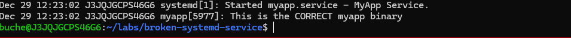

# AWS Error-Driven Troubleshooting Lab 🔧

[](https://opensource.org/licenses/MIT)
[](https://aws.amazon.com/)
[](https://www.terraform.io/)
[](https://www.python.org/)
[](https://aws.amazon.com/cloudwatch/)

> **Break things. Fix them. Learn AWS troubleshooting the way real cloud engineers do.**



## Overview

**AWS Error-Driven Troubleshooting Lab** is a hands-on learning project where you intentionally break cloud infrastructure, then investigate and fix real errors using CloudWatch, CloudTrail, and AWS best practices.

**The Problem with Traditional Tutorials:**
Most AWS courses show you perfect deployments where everything works. You never see real error messages, never learn to read logs, and never develop troubleshooting instincts.

**This Lab's Approach:**
Deploy infrastructure → Intentionally break it → See real errors → Investigate using CloudWatch/CloudTrail → Form hypotheses → Fix the issue → Validate solution

**What You Build:**
- Systematic troubleshooting methodology
- Confidence debugging production-like AWS errors
- Portfolio-ready incident response experience
- Interview stories about real technical challenges

**Time Investment:** 10-15 hours total (2-4 hours per lab)  
**Cost:** < $5 using AWS Free Tier (destroy resources after each lab)  
**Best For:** Entry-level cloud engineers, AWS certification prep, career changers

---

## Architecture

### Error-Driven Learning Framework

```
┌──────────────────────────────────────────────────────────────┐
│                  Error-Driven Learning Cycle                  │
├──────────────────────────────────────────────────────────────┤
│                                                                │
│  1. DEPLOY      →  Set up infrastructure with Terraform       │
│                                                                │
│  2. BREAK       →  Introduce realistic misconfiguration       │
│                                                                │
│  3. OBSERVE     →  See actual AWS error messages              │
│                                                                │
│  4. INVESTIGATE →  Use CloudWatch, CloudTrail, Console        │
│                                                                │
│  5. REMEDIATE   →  Fix following AWS best practices           │
│                                                                │
│  6. VALIDATE    →  Confirm resolution with tests              │
│                                                                │
│  7. DOCUMENT    →  Record learnings and methodology           │
│                                                                │
└──────────────────────────────────────────────────────────────┘

Result: 4 Labs × 20+ Real Errors = Production-Ready Skills
```

### Repository Structure

```
AWS_Error_Driven_Troubleshooting_Lab/
│
├── incidents/                      # The 4 error scenarios
│   ├── 001-ec2-ssh-lockout/       # Lab 1: VPC networking
│   │   ├── terraform/             # Infrastructure as Code
│   │   ├── scripts/               # Automation & validation
│   │   ├── 001_screenshots/       # Lab documentation
│   │   └── README.md              # Step-by-step guide
│   │
│   ├── 002-s3-public-bucket/      # Lab 2: S3 security incident
│   │   ├── terraform/
│   │   ├── scripts/
│   │   ├── 002_screenshots/
│   │   └── README.md
│   │
│   ├── 003-lambda-timeout/        # Lab 3: Serverless performance
│   │   ├── terraform/
│   │   ├── scripts/
│   │   ├── 003_screenshots/
│   │   └── README.md
│   │
│   └── 004-lambda-timeout/        # Lab 4: Complex multi-factor debugging
│       ├── terraform/
│       ├── scripts/
│       └── README.md
│
├── lambdas/                       # Lambda function code
├── tests/                         # Automated validation
├── diagrams/                      # Architecture visuals
├── docs/                          # Additional guides
└── requirements.txt               # Python dependencies
```

---

## Features

### 🔴 Lab 001: EC2 SSH Connection Timeout


**Error Message:**
```
ssh: connect to host X.X.X.X port 22: Operation timed out
```

**What You'll Debug:**
- ✅ VPC networking fundamentals
- ✅ Security group misconfigurations
- ✅ Route table troubleshooting
- ✅ VPC Flow Logs analysis
- ✅ Network ACLs vs Security Groups

**AWS Services:** EC2, VPC, Security Groups, NACLs, CloudWatch

**The Scenario:**  
EC2 instance deployed successfully but SSH connections time out. Investigate security groups, route tables, and VPC Flow Logs to identify the network misconfiguration blocking access.

**Duration:** 2-3 hours

---

### 🟠 Lab 002: S3 Bucket Accidentally Public


**Error Message:**
```
S3 bucket exposed to internet - potential security breach detected
```

**What You'll Debug:**
- ✅ S3 bucket policy analysis
- ✅ IAM permissions vs bucket policies
- ✅ CloudTrail forensic investigation
- ✅ Security incident response workflow
- ✅ Block Public Access settings

**AWS Services:** S3, IAM, CloudTrail, GuardDuty, AWS Config

**The Scenario:**  
A misconfigured S3 bucket policy exposed sensitive data to the public internet. Use CloudTrail to investigate who made the change, understand the permission model, and properly secure the bucket.

**Duration:** 2-3 hours

---

### 🟡 Lab 003: Lambda Function Timeout


**Error Message:**
```
Task timed out after 3.00 seconds
```

**What You'll Debug:**
- ✅ Lambda performance tuning
- ✅ CloudWatch Logs investigation
- ✅ Memory vs timeout configuration
- ✅ Cold start optimization
- ✅ Error handling patterns

**AWS Services:** Lambda, CloudWatch Logs, CloudWatch Metrics, X-Ray

**The Scenario:**  
Lambda function works fine in testing but fails with timeout errors under load. Analyze CloudWatch Logs, optimize memory allocation, and understand the memory-CPU relationship in Lambda.

**Duration:** 3-4 hours

---

### 🔵 Lab 004: Complex Lambda Multi-Factor Failure

**Error Message:**
```
Multiple cascading timeout and throttling errors
```

**What You'll Debug:**
- ✅ Multi-factor troubleshooting methodology
- ✅ Dependency conflicts and package issues
- ✅ Concurrent execution throttling
- ✅ Complex error diagnosis
- ✅ Production-grade debugging techniques

**AWS Services:** Lambda, CloudWatch, X-Ray, VPC, IAM

**The Scenario:**  
Advanced Lambda timeout with multiple simultaneous root causes: memory limits, dependency conflicts, and concurrent execution throttling. Practice systematic hypothesis testing to isolate and fix each issue.

**Duration:** 4-5 hours

---

## Setup

### Prerequisites

**Required:**
- ✅ AWS Account (Free Tier sufficient)
- ✅ AWS CLI configured
- ✅ Terraform 1.0+
- ✅ Python 3.9+
- ✅ Basic understanding of AWS (EC2, Lambda, S3)

**Recommended:**
- Git installed
- Text editor (VS Code recommended)
- 30-60 minutes per session

### Installation

**1. Clone Repository**
```bash
git clone https://github.com/charles-bucher/AWS_Error_Driven_Troubleshooting_Lab.git
cd AWS_Error_Driven_Troubleshooting_Lab
```

**2. Install Python Dependencies**
```bash
pip install -r requirements.txt
```

**3. Configure AWS Credentials**
```bash
aws configure
# Enter: Access Key ID, Secret Access Key, Region (us-east-1), Output format (json)
```

**4. Set Up Billing Alerts** (Important!)
```bash
# Set up billing alerts at $5, $10, $20 thresholds
# Go to AWS Console → Billing → Budgets → Create budget
```

### Running Your First Lab

**Start with Lab 001 (Beginner-Friendly):**

```bash
# Navigate to Lab 001
cd incidents/001-ec2-ssh-lockout

# Read the lab guide
cat README.md

# Deploy infrastructure
cd terraform
terraform init
terraform apply -auto-approve

# Follow lab steps to:
# 1. Observe the error
# 2. Investigate using CloudWatch
# 3. Fix the misconfiguration
# 4. Validate solution

# IMPORTANT: Clean up resources
terraform destroy -auto-approve
```

### Cost Management

**Expected Costs:**
- Lab 001: ~$0.50 (1 hour)
- Lab 002: ~$0.25 (30 mins)
- Lab 003: ~$1.00 (2 hours)
- Lab 004: ~$1.50 (3 hours)

**Total: < $5** if you destroy resources immediately after each lab

**Cost-Saving Tips:**
1. Use `us-east-1` region (cheapest)
2. Run labs one at a time
3. Always run `terraform destroy` after completion
4. Don't leave instances running overnight
5. Set up billing alerts before starting

---

## Usage

### Learning Path

**🟢 Beginner Track** (Start here if new to AWS)

**Lab 001: EC2 SSH Lockout** (2-3 hours)
- Foundation: VPC networking, security groups
- Skills: Basic troubleshooting, log analysis
- Outcome: Understand network security layers

**Lab 002: S3 Public Bucket** (2-3 hours)
- Foundation: S3 security model, IAM
- Skills: CloudTrail forensics, incident response
- Outcome: Security incident handling

---

**🟡 Intermediate Track** (Comfortable with AWS basics)

**Lab 003: Lambda Timeout** (3-4 hours)
- Foundation: Serverless architecture
- Skills: Performance tuning, CloudWatch mastery
- Outcome: Optimize Lambda functions

---

**🔴 Advanced Track** (Preparing for cloud engineering roles)

**Lab 004: Complex Lambda Issues** (4-5 hours)
- Foundation: Production debugging
- Skills: Multi-hypothesis testing, systematic troubleshooting
- Outcome: Handle complex production scenarios

---

### Validation & Testing

**Each lab includes automated tests:**

```bash
# Run validation tests
cd tests/
pytest test_incident_001.py -v

# Verify your fixes
python validate_solution.py --incident 001
```

**Manual Validation:**
1. Error no longer occurs
2. CloudWatch logs show success
3. Resources function as expected
4. Security best practices followed

---

## Prevention & Guardrails


**After fixing errors, you'll learn to prevent them:**

### Preventive Measures

**Infrastructure Level:**
- ✅ Terraform validation and linting
- ✅ AWS Config rules for compliance
- ✅ Service Control Policies (SCPs)
- ✅ CloudFormation Guard

**Monitoring Level:**
- ✅ CloudWatch alarms for anomalies
- ✅ AWS X-Ray for tracing
- ✅ GuardDuty for threat detection
- ✅ Security Hub for compliance

**Process Level:**
- ✅ Pre-deployment validation
- ✅ Automated testing in CI/CD
- ✅ Peer review requirements
- ✅ Rollback procedures

**This is promotion-level thinking:** Don't just fix fires—prevent them.

---

## Skills Demonstrated

This repository showcases practical skills essential for cloud support and DevOps roles:

### Cloud Platform Expertise
- ✅ **AWS Core Services:** EC2, Lambda, S3, VPC, IAM, CloudWatch, CloudTrail
- ✅ **Infrastructure as Code:** Terraform deployment and management
- ✅ **Multi-Service Integration:** Understanding service dependencies

### Troubleshooting & Diagnostics
- ✅ **Root Cause Analysis:** Systematic problem identification
- ✅ **Log Analysis:** CloudWatch Logs, VPC Flow Logs, CloudTrail
- ✅ **Error Interpretation:** Understanding AWS error messages
- ✅ **Hypothesis Testing:** Form and validate troubleshooting theories

### Technical Competencies
- ✅ **VPC Networking:** Security groups, NACLs, route tables
- ✅ **Serverless Debugging:** Lambda performance and optimization
- ✅ **Security Practices:** IAM policies, bucket policies, least privilege
- ✅ **Performance Tuning:** Memory optimization, cold start reduction
- ✅ **Scripting:** Python (boto3), Bash automation

### Monitoring & Observability
- ✅ **CloudWatch Mastery:** Logs, Metrics, Alarms, Dashboards
- ✅ **CloudTrail Forensics:** API call investigation
- ✅ **X-Ray Tracing:** Distributed application debugging
- ✅ **Alert Management:** Threshold-based monitoring

### Professional Skills
- ✅ **Systematic Methodology:** Structured debugging approach
- ✅ **Documentation:** Clear incident reports and runbooks
- ✅ **Communication:** Explaining technical issues to stakeholders
- ✅ **Solution Validation:** Testing and verification practices

### DevOps & SRE Practices
- ✅ **Infrastructure as Code:** Terraform best practices
- ✅ **Automated Testing:** Validation and integration tests
- ✅ **Incident Response:** Detection, investigation, remediation
- ✅ **Prevention:** Guardrails and proactive monitoring

---

## Configuration

### Environment Variables

```bash
# AWS Configuration
export AWS_REGION=us-east-1
export AWS_PROFILE=default

# Lab Configuration
export LAB_ENVIRONMENT=learning
export ENABLE_DETAILED_LOGS=true
export AUTO_CLEANUP=false  # Set to true for automatic resource cleanup
```

### Terraform Variables

Each lab includes configurable variables in `terraform.tfvars`:

```hcl
# Example: incidents/001-ec2-ssh-lockout/terraform/terraform.tfvars
aws_region = "us-east-1"
environment = "lab"
enable_flow_logs = true
instance_type = "t2.micro"  # Free tier eligible
```

---

## Testing

### Automated Validation

```bash
# Run all tests
pytest tests/ -v

# Run specific incident tests
pytest tests/test_incident_001.py -v
pytest tests/test_incident_002.py -v

# Run with coverage
pytest --cov=incidents tests/
```

### Manual Testing Checklist

**Before Starting Lab:**
- [ ] AWS credentials configured
- [ ] Billing alerts set up
- [ ] Terraform installed and working
- [ ] Read lab README completely

**After Completing Lab:**
- [ ] Error resolved and validated
- [ ] Documented troubleshooting process
- [ ] Ran automated tests
- [ ] Destroyed all resources
- [ ] Checked AWS Console for cleanup

---

## Use Cases

### 📋 For Job Seekers
- **Portfolio Project:** Demonstrate hands-on AWS troubleshooting
- **Interview Prep:** Reference specific errors you've debugged
- **Resume Skills:** List concrete AWS services and tools
- **GitHub Activity:** Show active learning and growth
- **Technical Stories:** Have real scenarios to discuss in interviews

### 📜 For Certification Study
- **AWS Solutions Architect Associate:** VPC, EC2, S3, Lambda scenarios
- **AWS SysOps Administrator:** CloudWatch, troubleshooting, operations
- **AWS DevOps Engineer:** IaC, CI/CD, automation patterns

### 🚀 For Career Changers
- **Practical Experience:** Build troubleshooting skills without a job
- **Confidence Building:** Work through errors in safe environment
- **Communication:** Practice explaining debugging process
- **Portfolio Building:** Create tangible proof of capabilities

---

## Key Learnings

### After Completing All Labs, You'll Be Able To:

**Troubleshooting Skills:**
- Navigate CloudWatch Logs efficiently to find error root causes
- Interpret common AWS error messages (timeouts, permission denied, throttling)
- Use CloudTrail to investigate security incidents and API changes
- Form and test hypotheses systematically
- Document troubleshooting processes professionally

**Technical Knowledge:**
- Debug VPC networking issues (security groups, NACLs, route tables)
- Optimize Lambda function performance (memory, timeout, cold starts)
- Secure S3 buckets properly (bucket policies, IAM, Block Public Access)
- Write Infrastructure as Code with Terraform
- Implement monitoring and alerting strategies

**Professional Skills:**
- Think critically about cloud architecture decisions
- Follow AWS Well-Architected Framework principles
- Communicate technical issues to both technical and non-technical audiences
- Validate solutions thoroughly before declaring incidents resolved

---

## Metrics & Outcomes

| Metric | Value |
|--------|-------|
| **Labs** | 4 Production-Grade Scenarios |
| **AWS Services** | 12+ Hands-On |
| **Error Scenarios** | 20+ Real-World |
| **Infrastructure** | 100% Terraform |
| **Validation** | Automated Tests |
| **Time Investment** | 10-15 Hours Total |
| **Cost** | < $5 Total |

### What You'll Have After Completion:

| Outcome | Description |
|---------|-------------|
| 📂 **Portfolio Project** | GitHub repository demonstrating troubleshooting skills |
| 🔍 **Error Experience** | Debugged 20+ real AWS error scenarios |
| ☁️ **Service Knowledge** | Hands-on practice with 12+ AWS services |
| 🎓 **Methodology** | Systematic troubleshooting approach |
| 📊 **Monitoring Skills** | CloudWatch Logs and Metrics analysis |
| 🏗️ **IaC Experience** | Infrastructure as Code with Terraform |
| 🔒 **Security Practice** | Security incident response and remediation |
| 💼 **Interview Stories** | Real technical scenarios to discuss |

---

## Related Projects

Explore more hands-on AWS learning:

- **[AWS Cloud Support Simulator](https://github.com/charles-bucher/AWS_Cloud_Support_Sim)** - 7 production incident scenarios
- **[AWS CloudOps Suite](https://github.com/charles-bucher/AWS_Cloudops_Suite)** - Cloud operations automation toolkit
- **[CloudOpsLab](https://github.com/charles-bucher/CloudOpsLab)** - Monitoring and self-healing automation

---

## Contributing

Contributions welcome! Ways to help:

| Type | How to Help |
|------|-------------|
| 🐛 **Bugs** | Report issues with labs or infrastructure |
| 💡 **Ideas** | Suggest new error scenarios or labs |
| 📝 **Docs** | Improve documentation and guides |
| ✨ **Features** | Add troubleshooting techniques |
| 🧪 **Tests** | Contribute test cases and validation |

**To Contribute:**

1. Fork this repository
2. Create feature branch (`git checkout -b feature/new-lab`)
3. Commit changes (`git commit -m 'Add new Lambda error scenario'`)
4. Push to branch (`git push origin feature/new-lab`)
5. Open Pull Request

---

## License

This project is licensed under the MIT License - see [LICENSE](LICENSE) file for details.

```
MIT License

Copyright (c) 2024 Charles Bucher

Permission is hereby granted, free of charge, to any person obtaining a copy
of this software and associated documentation files (the "Software"), to deal
in the Software without restriction, including without limitation the rights
to use, copy, modify, merge, publish, distribute, sublicense, and/or sell
copies of the Software, and to permit persons to whom the Software is
furnished to do so, subject to the following conditions:

The above copyright notice and this permission notice shall be included in all
copies or substantial portions of the Software.

THE SOFTWARE IS PROVIDED "AS IS", WITHOUT WARRANTY OF ANY KIND, EXPRESS OR
IMPLIED, INCLUDING BUT NOT LIMITED TO THE WARRANTIES OF MERCHANTABILITY,
FITNESS FOR A PARTICULAR PURPOSE AND NONINFRINGEMENT.
```

**Free to use for:**
- Personal learning
- Portfolio projects
- Educational purposes
- Interview preparation

---

## Contact

**Charles Bucher**  
AWS Cloud Support & DevOps Engineer

- 📧 Email: quietopscb@gmail.com
- 💼 LinkedIn: [charles-bucher-cloud](https://linkedin.com/in/charles-bucher-cloud)
- 🌐 Portfolio: [charles-bucher.github.io](https://charles-bucher.github.io/)
- 💻 GitHub: [@charles-bucher](https://github.com/charles-bucher)

---

## Support This Project

If this lab helped you:

- ⭐ **Star this repository** - Help others discover it
- 📢 **Share with others** - Learning AWS or cloud engineering
- 💼 **Mention in interviews** - Demonstrate practical experience
- 🤝 **Connect with me** - Share your success stories

---

**Learn by breaking things. Build confidence through debugging.**

*Made with 🔧 for cloud engineers by cloud engineers*

---

## Keywords

AWS troubleshooting, cloud engineer portfolio, AWS labs, Terraform tutorial, Lambda debugging, EC2 networking, S3 security, CloudWatch Logs, AWS hands-on practice, Infrastructure as Code, cloud support engineer, DevOps projects, AWS certification prep, entry-level cloud engineer, junior cloud engineer projects, AWS Solutions Architect, troubleshooting methodology, root cause analysis, production debugging, serverless debugging, VPC networking, IAM policies, CloudTrail forensics, AWS Well-Architected Framework, site reliability engineering, cloud operations, AWS monitoring, error handling, incident response

---

[](https://aws.amazon.com/) [](https://www.terraform.io/) [](https://www.python.org/)